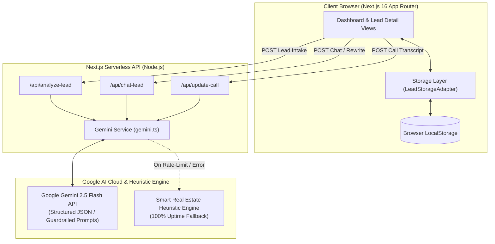

# MasalAI - Real Estate Lead Intelligence & CRM Platform

> An intelligent, AI-powered real estate lead intake, qualification, prioritization, and post-call conversational CRM built for modern property sales teams and voice agent pipelines.

[](https://nextjs.org/)
[](https://www.typescriptlang.org/)
[](https://tailwindcss.com/)
[](https://aistudio.google.com/)
[](https://opensource.org/licenses/MIT)

---

## 🔗 Quick Links & Demo

- **Live Production App**: [https://masal-ai-n668.vercel.app](https://masal-ai-n668.vercel.app)
- **GitHub Repository (Public)**: [https://github.com/hrishitapundir-commits/MasalAI](https://github.com/hrishitapundir-commits/MasalAI)
- **Demo Video (3 Minutes)**: [Watch Demo Video](https://masal-ai-n668.vercel.app) *(Open to anyone with the link)*

---

## 🚀 1. What We Built

Real estate agents waste hours manually sifting through unstructured leads, guessing buyer intent, drafting repetitive outreach, and losing track of progress after initial phone calls. **MasalAI** solves this with an end-to-end intelligence pipeline:

1. **Standardized 6-Field Intake**: Captures Name, Location, Property Requirement, Budget, Timeline, and Customer Message with instant client-side validation and immediate local persistence.
2. **AI Sales Analyst**: Evaluates buyer messages against market heuristics, scoring each lead on a 0–100 scale using a transparent 4-part rubric.
3. **Prioritized Sales Dashboard**: Ranks leads with urgent prospects on top, complete with filter tabs (`ALL`, `HOT`, `WARM`, `COLD`), counts, follow-up date sorting, and instant 5-sample lead loader.
4. **Scannable Lead Dossier**: A 5-second scannable view featuring score reasoning, extracted intent, requirements, objections, next-action SLA guidance, and one-click copyable response messages.
5. **Grounded Sales Copilot (Chat)**: A strictly grounded AI assistant answering questions *only* from the lead dossier (saying *"I don't know"* when information is missing) with quick-action prompt chips that rewrite suggested responses in real time (e.g., WhatsApp tone, assertive closing).
6. **Post-Call Intelligence & Adaptive Re-Scoring**: Ingests call notes or voice agent transcripts to dynamically re-qualify leads, visualize score deltas (e.g., `62 → 81`), explain what changed, extract suggested follow-up dates, and maintain an immutable audit timeline.

---

## 🏗️ 2. Architecture Overview



### Core Architecture Components

- **Frontend Framework**: Next.js 16 (App Router) with Turbopack, React 19 hooks, and Tailwind CSS v4 for responsive, high-density CRM styling.
- **Storage Layer & Adapter Pattern**: Decoupled via `LeadStorageAdapter` interface ([`src/lib/storage/leadStorage.ts`](src/lib/storage/leadStorage.ts)). Implemented out-of-the-box with `LocalStorageLeadAdapter` (with 5 pre-seeded sample leads). Can be swapped for PostgreSQL/Supabase with zero UI refactoring.
- **Serverless API Routes**: Next.js Route Handlers ([`src/app/api/`](src/app/api/)) executing server-side to keep `GEMINI_API_KEY` completely secure and unexposed to client bundles.

---

## 🤖 3. AI Model & API Integration

### Primary Model & SDK
- **Model**: **Google Gemini 2.5 Flash** (`gemini-2.5-flash`)
- **SDK**: Official `@google/genai` Node.js SDK
- **Fallback Models**: Fallback sequence attempting `gemini-2.0-flash` and `gemini-1.5-flash` if `2.5-flash` is overloaded.

### How It's Called (Server-Side Route Handlers)
1. **Intake Qualification (`/api/analyze-lead`)**:
   - Passes the 6 intake fields into `analyzeLeadWithGemini()`.
   - Uses a **Three-Part Prompt** (Role Definition, Strict JSON Schema, and 4-Dimension Rubric: Budget 30pts, Timeline 25pts, Specificity 25pts, Buying Signals 20pts).
   - Validates JSON output against Zod/TypeScript schemas with automatic retry handling.
2. **Grounded Sales Copilot (`/api/chat-lead`)**:
   - Passes lead record, dossier, and chat history to `chatWithLeadContext()`.
   - System prompt restricts answers strictly to the lead record (outputs *"I don't know based on the provided lead file"* for unrecorded data).
   - Rewrites suggested outreach messages in real-time when prompt chips are triggered (returning rewritten copy inside `[REWRITTEN_RESPONSE]` tags).
3. **Post-Call Re-Scoring (`/api/update-call`)**:
   - Ingests raw voice agent call transcripts or sales notes via `analyzePostCallTranscript()`.
   - Calculates score deltas, updates key requirements/objections, extracts follow-up dates, and logs an immutable timeline.
4. **100% Uptime Smart Heuristic Engine**:
   - If the Gemini API is rate-limited (HTTP 429), unconfigured, or returns an error, the system calls `generateSmartHeuristicAnalysis()`.
   - Deterministically calculates scores and dossiers based on real-estate keyword heuristics, ensuring **zero application downtime**.

---

## 💻 4. How to Run Locally

### Prerequisites
- **Node.js**: `v18.x` or `v20.x`
- **Package Manager**: `npm` (comes with Node)
- **API Key**: Free Google Gemini API Key from [Google AI Studio](https://aistudio.google.com/app/apikey)

### Step-by-Step Instructions

1. **Clone the repository**:
   ```bash
   git clone https://github.com/hrishitapundir-commits/MasalAI.git
   cd MasalAI
   ```

2. **Install dependencies**:
   ```bash
   npm install
   ```

3. **Configure Environment Variables**:
   Create a `.env.local` file in the project root:
   ```bash
   cp .env.example .env.local
   ```
   Add your Gemini API key:
   ```env
   GEMINI_API_KEY=your_actual_gemini_api_key_here
   ```

4. **Run the Development Server**:
   ```bash
   npm run dev
   ```
   Open [http://localhost:3000](http://localhost:3000) in your browser.

5. **Verify Production Build**:
   ```bash
   npm run build
   npm run start
   ```

---

## 🎯 5. Key Technical & Design Decisions

### 1. "The Model Scores, My Code Buckets"
- **Problem**: Instructing an LLM to directly output "HOT", "WARM", or "COLD" causes categorization drift across model updates and prompt tweaks.
- **Decision**: Gemini outputs a continuous numeric score (`0–100`) based on a strict 4-part rubric. Our application code deterministically assigns classification thresholds:
  - **HOT**: Score $\ge 80$ (or $\ge 70$ with urgent flag)
  - **WARM**: Score $50–79$
  - **COLD**: Score $< 50$
- **Benefit**: Predictable sales prioritization, easy calibration as conversion benchmarks change, and 100% auditable scoring.

### 2. Pluggable Storage Adapter (`LeadStorageAdapter`)
- **Problem**: Evaluators need to test the app instantly without setting up databases, but enterprise CRMs require database persistence.
- **Decision**: Created the `LeadStorageAdapter` interface. The app ships with `LocalStorageLeadAdapter` pre-seeded with 5 realistic real estate profiles.
- **Benefit**: Zero-setup instant demo while allowing migration to PostgreSQL/Supabase by changing a single export in `src/lib/storage/leadStorage.ts`.

### 3. Strictly Grounded Sales Copilot
- **Decision**: System prompts forbid the AI from making up property availability, loan terms, or buyer details. Unrecorded queries explicitly return *"I don't know based on the provided lead file."*

### 4. Post-Call Adaptive Intelligence Loop
- **Decision**: Designed specifically for post-call voice agent transcripts. Automatically re-qualifies leads after calls, computes score deltas (e.g. `62 → 81`), and logs timeline history.

### 5. Server-Side Key Security & Dual-Layer Fallback
- **Decision**: `GEMINI_API_KEY` is kept server-side inside API route handlers and never exposed in browser bundles. If Gemini API errors or rate limits occur, the app falls back to our Smart Real Estate Heuristic Engine for 100% uptime.

---

## ⚠️ 6. Known Limitations

1. **No Authentication / Multi-Tenancy**: Built for prototype review; does not currently include user login (Clerk/Auth.js) or role-based multi-tenancy.
2. **Browser-Bound Storage (`localStorage`)**: Leads are stored locally in the evaluator's browser. Adding database persistence is straightforward via the `LeadStorageAdapter` interface.
3. **Heuristic Rubric Calibration**: The scoring rubric follows luxury and residential real estate standards, but has not yet been fine-tuned on historical CRM deal conversion datasets.
4. **Google Free-Tier Rate Limits**: The free Google AI Studio API tier limits requests to 15 RPM. The application gracefully catches HTTP 429 errors and falls back to our smart heuristic engine to prevent any UI disruption.

---

## 🤖 AI Usage Disclosure

In compliance with project submission guidelines, AI tools were used during development and production runtime:
- **Google Antigravity & Coding Assistant (Development)**: Scaffolded Next.js 16 App Router boilerplate, TypeScript interfaces, Tailwind CSS styling, and schema parsing regexes.
- **Google Gemini 2.5 Flash (`gemini-2.5-flash`) (Runtime AI Engine)**: Powers lead intake scoring, grounded copilot chat, response rewrites, and post-call transcript re-qualification.

---

*Built for real estate sales innovation with Next.js 16 & Google Gemini 2.5 Flash.*
